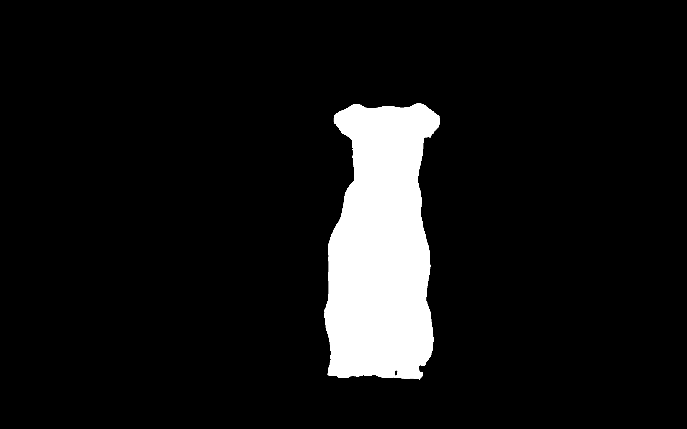

<div align="center">
  
  <h1>Osam</h1>
  <p>
    Get up and running with segment-anything models locally.
  </p>
  <br>
  <br>
  <br>
</div>

*Osam* (/oʊˈsɑm/) is a tool to run open-source segment-anything models locally
(inspired by [Ollama](https://github.com/ollama/ollama)).

*Osam* provides:

- **Segment-Anything Models** - original SAM, Efficient-SAM;
- **Local APIs** - CLI & Python & HTTP interface;
- **Customization** - Host custom vision models.


## Installation

### Pre-built binaries

[Download](https://github.com/wkentaro/osam/releases/latest)

### Pip

<a href="https://pypi.org/project/osam"></a>
<a href="https://pypi.python.org/pypi/osam"></a>

```bash
pip install osam
```

## Quickstart

To run with Efficient-SAM:

```bash
osam run efficient-sam:25m --image <image_file>
```

## Model library

Here are models that can be downloaded:

| Model             | Parameters | Size  | Download                     |
|-------------------|------------|-------|------------------------------|
| SAM 91M           | 91M        | 100MB | `osam run sam:91m`           |
| SAM 308M          | 398M       | 320MB | `osam run sam:308m`          |
| SAM 636M          | 636M       | 630MB | `osam run sam:636m`          |
| Efficient-SAM 10M | 10M        | 40MB  | `osam run efficient-sam:10m` |
| Efficient-SAM 25M | 25M        | 100MB | `osam run efficient-sam:25m` |

## Usage

### CLI

```bash
# Run a model with an image
osam run efficient-sam:25m --image examples/_images/dogs.jpg > output.png

# Get a JSON output
osam run efficient-sam:25m --image examples/_images/dogs.jpg --json
# {"model": "efficient-sam:25m", "mask": "..."}

# Give a prompt
osam run efficient-sam:25m --image examples/_images/dogs.jpg \
  --prompt '{"points": [[1439, 504], [1439, 1289]], "point_labels": [1, 1]}' > output.png
```

   
<i>Input and output images ('dogs.jpg', 'output.png').</i>

### Python

```python
import osam.apis
import osam.types

request = osam.types.GenerateRequest(
    model="efficient-sam:25m",
    image=np.asarray(PIL.Image.open("examples/_images/dogs.jpg")),
    prompt=osam.types.Prompt(points=[[1439, 504], [1439, 1289]], point_labels=[1, 1]),
)
response = osam.apis.generate(request=request)
PIL.Image.fromarray(response.mask).save("mask.png")
```
   
<i>Input and output images ('dogs.jpg', 'mask.png').</i>

### HTTP

```bash
# Get up the server
osam serve

# POST request
curl 127.0.0.1:11368/api/generate -X POST \
  -H "Content-Type: application/json" \
  -d "{\"model\": \"efficient-sam:25m\", \"image\": \"$(cat examples/_images/dogs.jpg | base64)\"}" \
  | jq -r .mask | base64 --decode > mask.png
```

## License

MIT
