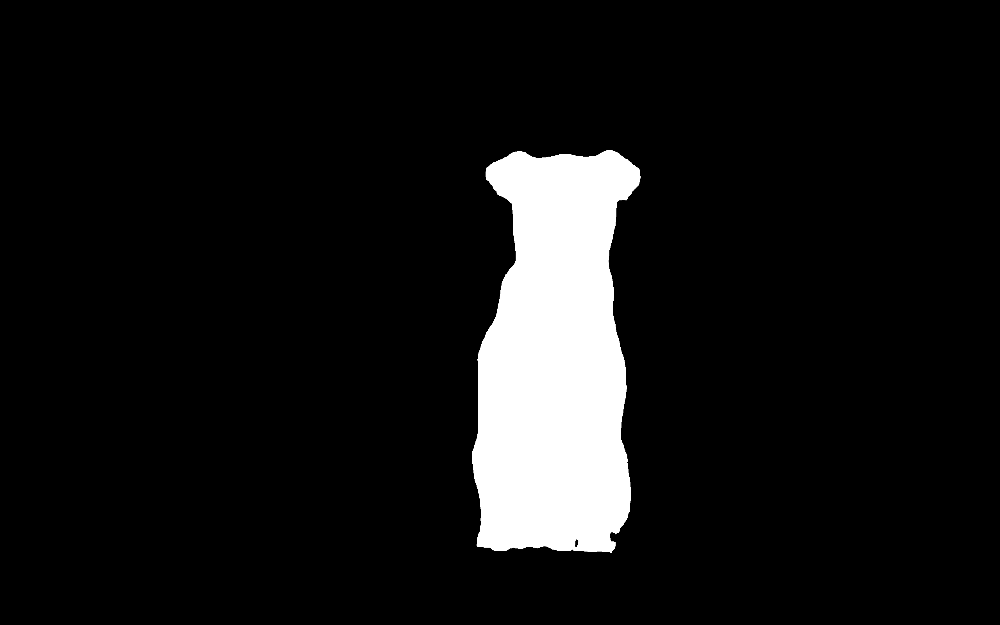

<div align="center">
  <h1>Osam</h1>
  <p>
    Get up and running with promptable vision models locally.
  </p>
  <br>
  <br>
  <br>
</div>

*Osam* (/oʊˈsɑm/) is a tool to run open-source promptable vision models locally
(inspired by [Ollama](https://github.com/ollama/ollama)).

*Osam* provides:

- **Promptable Vision Models** - Segment Anything Model (SAM), EfficientSAM, YOLO-World;
- **Local APIs** - CLI & Python & HTTP interface;
- **Customization** - Host custom vision models.

## Installation

### Pip

<a href="https://pypi.org/project/osam"></a>
<a href="https://pypi.python.org/pypi/osam"></a>

```bash
pip install osam
```

**For `osam serve`**:

```bash
pip install osam[serve]
```

## Quickstart

To run with EfficientSAM:

```bash
osam run efficientsam --image <image_file>
```

To run with YOLO-World:

```bash
osam run yoloworld --image <image_file>
```

## Model library

Here are models that can be downloaded:

| Model            | Parameters | Size  | Download                    |
| ---------------- | ---------- | ----- | --------------------------- |
| SAM 100M         | 94M        | 100MB | `osam run sam:100m`         |
| SAM 300M         | 313M       | 310MB | `osam run sam:300m`         |
| SAM 600M         | 642M       | 630MB | `osam run sam`              |
| SAM2 Tiny        | 39M        | 150MB | `osam run sam2:tiny`        |
| SAM2 Small       | 46M        | 170MB | `osam run sam2:small`       |
| SAM2 BasePlus    | 82M        | 300MB | `osam run sam2`             |
| SAM2 Large       | 227M       | 870MB | `osam run sam2:large`       |
| SAM3             | 893M       | 3.4GB | `osam run sam3`             |
| EfficientSAM 10M | 10M        | 40MB  | `osam run efficientsam:10m` |
| EfficientSAM 30M | 26M        | 100MB | `osam run efficientsam`     |
| YOLO-World XL    | 168M       | 640MB | `osam run yoloworld`        |

PS. `sam`, `efficientsam` is equivalent to `sam:latest`, `efficientsam:latest`.

### Custom download endpoint

Models are downloaded from their canonical URLs by default. To download from a
mirror instead (for example, in networks where the canonical hosts are blocked),
set `OSAM_BLOB_ENDPOINT` to a comma-separated list of endpoints tried in order:

```bash
# Try the mirror first, then fall back to the canonical host.
export OSAM_BLOB_ENDPOINT="https://mirror.example.com,direct"
```

Each blob is fetched from `<endpoint>/<sha256-hex>`; the reserved value `direct`
uses the model's canonical URL. Downloads are verified by SHA-256 regardless of
the endpoint, so a mirror cannot serve corrupted data. When unset, only `direct`
is used. Omit `direct` from the list (for example
`OSAM_BLOB_ENDPOINT="https://mirror.example.com"`) to disable the canonical
fallback and serve every blob from the mirror only.

## Usage

### CLI

```bash
# Run a model with an image
osam run efficientsam --image examples/_images/dogs.jpg > output.png

# Get a JSON output
osam run efficientsam --image examples/_images/dogs.jpg --json
# {"model": "efficientsam", "mask": "..."}

# Give a prompt
# 1. point prompt (background=0, foreground=1)
osam run efficientsam --image examples/_images/dogs.jpg \
  --prompt '{"points": [[1439, 504], [1439, 1289]], "point_labels": [1, 1]}' \
  > efficientsam_point.png
# 2. box prompt with sam2 (lt=2, rb=3)
osam run sam2 --image examples/_images/dogs.jpg \
  --prompt '{"points": [[1233, 376], [1649, 691]], "point_labels": [2, 3]}' \
  > sam2_box.png
# 3. text prompt
osam run sam3 --image examples/_images/dogs.jpg --prompt '{"texts": ["dog"]}' \
  > sam3_text.png
# 4. box prompt with sam3 (lt=2, rb=3)
osam run sam3 --image examples/_images/dogs.jpg \
  --prompt '{"points": [[1233, 376], [1649, 691]], "point_labels": [2, 3]}' \
  > sam3_box.png
```

   \
<i>Output images: 'efficientsam_point.png', 'sam2_box.png', 'sam3_text.png', 'sam3_box.png'</i>

### Python

```python
import numpy as np
from PIL import Image

import osam

image = np.asarray(Image.open("examples/_images/dogs.jpg"))
request = osam.types.GenerateRequest(
    model="efficientsam",
    image=image,
    prompt=osam.types.Prompt(points=[[1439, 504], [1439, 1289]], point_labels=[1, 1]),
)
response = osam.apis.generate(request=request)
annotation = response.annotations[0]
mask = np.zeros(image.shape[:2], dtype=np.bool_)
bbox = annotation.bounding_box
mask[bbox.ymin:bbox.ymax + 1, bbox.xmin:bbox.xmax + 1] = annotation.mask
Image.fromarray(mask).save("mask.png")
```

 \
<i>Input and output images ('dogs.jpg', 'mask.png').</i>

### HTTP

```bash
# pip install osam[serve]  # required for `osam serve`

# Get up the server
osam serve

# POST request
base64 < examples/_images/dogs.jpg \
  | jq -Rs '{model: "efficientsam", image: gsub("\n"; "")}' \
  | curl 127.0.0.1:11368/api/generate -X POST --json @- \
  | jq -r '.annotations[0].mask' | base64 --decode > mask.png
```
